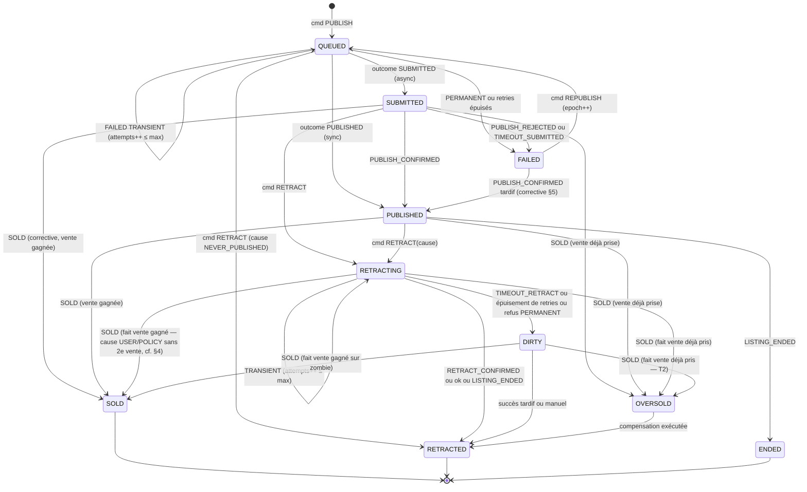

# SYNC-FSM — FSM canonique de synchronisation multi-canal (P4, 2026-07-13)

> **Objectif unique du gate** : UNE machine à états capable de représenter tous les états de
> synchronisation d'un listing sur N canaux — async, échecs partiels, retract en cours,
> double-vente, retries, doublons, désordre, connecteur indisponible.
> Ancrée sur ADAPTER-CONTRACT (§3 port + A1, §6 cycle — étendu **additivement**, comme prévu)
> et THREAT-MODEL (INV-1…5, 11, 12). Aucun état propre à une marketplace (INV-23).
> Rappel D5 : la FSM expose des **faits** ; toute politique (facturation, remboursement,
> compensation) est **Business Policy — hors Core** (§8).

---

## 0. Architecture de la vérité — une seule FSM stockée

1. **FSM autoritaire : par `(listing, canal)`** — `ChannelPublication.status` (Zod SSOT, DB String).
   C'est la SEULE machine stockée.
2. **Un fait listing-niveau : LA vente** — enregistrée une seule fois (set-once, §4). Le seul
   fait de sync qui ne soit pas dérivable des lignes par canal.
3. **La vue agrégée (§7) est une fonction pure**, jamais stockée — donc librement modifiable
   (two-way door). Stocker un agrégat créerait une seconde vérité qui dérive (leçon F3).
4. **`ListingStatus` (11 états) reste la machine du pipeline de création** (argent + IA +
   validation), autoritaire jusqu'à QUEUED. Au-delà, sa queue (`PUBLISHED`, `PUBLISH_FAILED`)
   devient une **projection** de la vue agrégée — conservée pour compat, jamais une 2ᵉ vérité.

Croyance vs vérité — la distinction qui gouverne le désordre (§5) :
- **États de vérité-canal** (attestés par le canal) : `SUBMITTED`, `PUBLISHED`, `SOLD`, `ENDED`, `RETRACTED` (confirmé).
- **États de croyance interne** (notre point de vue, faillible) : `QUEUED`, `RETRACTING`, `FAILED`, `DIRTY`, `OVERSOLD`.
- Règle : un événement authentifié du canal peut toujours **réaligner la croyance** sur la
  vérité ; la vérité-canal enregistrée, elle, **ne recule jamais**.

## 1. États (10) — minimalité justifiée

| État | Rôle | Ce qui devient irreprésentable si on le supprime |
|---|---|---|
| `QUEUED` | Publication décidée, I/O pas (encore) abouti ; porte les retries | Retries et connecteur indisponible (mandat) |
| `SUBMITTED` | Accepté par le canal, pas encore live (`submissionRef`) | Publications **asynchrones** (C4 — classe `publishMode: ASYNC`, pas un canal) |
| `PUBLISHED` | Annonce vivante — seul état où offres/vente sont attendues | — (le cœur) |
| `RETRACTING` | Retrait demandé, non confirmé ; porte les retries de retrait | **Retract en cours** (mandat) ; sans lui, DIRTY n'a pas d'origine |
| `SOLD` | Vendu ICI — le canal gagnant du fait vente | Ancre de la vente et de la cascade (§4) |
| `OVERSOLD` | 2ᵉ vente encaissée canal-side à annuler — obligation de compensation | **Double-vente matérialisée** (mandat) : sans lui, l'obligation d'annuler disparaît en silence |
| `RETRACTED` | Retiré (cause : `CONFIRMED` \| `CHANNEL_ENDED` \| `NEVER_PUBLISHED` \| `MANUAL`) | Terminal neutre ; les variantes sont des **causes**, pas des états |
| `ENDED` | Terminé par le canal (expiration, politique) sans action de notre part | Fin spontanée ≠ retrait voulu — indispensable à la réconciliation |
| `FAILED` | Échec permanent de publication (borne des retries) | **Partial failure** par canal (mandat) ; base de `REPUBLISH` |
| `DIRTY` | Irrétractable après épuisement — incident de niveau argent (T2) | La publication **zombie** ; sans lui elle se déguise en RETRACTING éternel |

Chaque état sert une **classe** de canaux ou un couple quelconque de canaux, jamais une
marketplace nommée : `SUBMITTED` ⇔ `publishMode: ASYNC` (Amazon, ManoMano, Cdiscount — la
classe, pas le nom) ; `OVERSOLD`/`DIRTY` ⇔ n'importe quelle paire de canaux en course (INV-23).

## 2. Entrées de la machine

| Classe | Entrées | Source |
|---|---|---|
| Événements canal | `PUBLISH_CONFIRMED`, `PUBLISH_REJECTED`, `SOLD`, `RETRACT_CONFIRMED`, `LISTING_ENDED`, `OFFER_RECEIVED`, `MESSAGE_RECEIVED` | `parseEvent` (contrat §3), **dédupliqués par `(channel, eventKey)`** (A1) AVANT la FSM |
| Résultats d'opération | `PublishOutcome` (PUBLISHED \| SUBMITTED \| FAILED T/P), `OpOutcome` (retract/update) | Appels sortants du connecteur |
| Commandes | `PUBLISH` (post USER_VALIDATED), `RETRACT(cause: SOLD_ELSEWHERE \| USER \| POLICY)`, `REPUBLISH` (`epoch++`) | Cascade interne, user, admin |
| Timers | `RETRY` (backoff), `TIMEOUT_SUBMITTED`, `TIMEOUT_RETRACT` | Bornes par canal — **données** de matrix/config, jamais de forme |

`OFFER_RECEIVED`/`MESSAGE_RECEIVED` ne transitionnent jamais : routés vers NegotiationService
en `PUBLISHED` ; **auto-refusés** en `RETRACTING`/post-vente (INV-11) ; stale-drop ailleurs.

## 3. Transitions

**Règle de totalité (INV-22)** : tout couple `(état, entrée)` non listé = **stale-drop
journalisé** (événement) ou **refus journalisé** (commande). Aucun cas indéfini — l'implémentation
TS l'atteste par `switch` exhaustif (`never`).

Arêtes non triviales :
- **`QUEUED → RETRACTED (NEVER_PUBLISHED)`** : la cascade annule une publication jamais partie —
  aucune I/O canal. Si un outcome `PUBLISHED` croise cette annulation (course avec le worker),
  la vérité-canal prime : corrective → `RETRACTING` (l'annonce est live, il faut la retirer).
- **`SUBMITTED → SOLD`** : le feed est passé live et a vendu avant notre poll — fast-forward,
  le `PUBLISH_CONFIRMED` implicite est journalisé.
- **`FAILED → PUBLISHED` (confirm tardif)** : timeout prononcé puis le canal confirme. La
  vérité-canal (annonce live) prime sur notre croyance FAILED — sinon zombie non tracké, pire
  qu'une entorse à la monotonie. Journal + métrique dashboard « late-confirm » ; les couches
  hautes (Billing) réagissent au changement de fait — pas notre problème (§8).
- **`RETRACTING → RETRACTED` sur `LISTING_ENDED`** : le canal a terminé l'annonce pendant notre
  retrait — l'objectif (plus d'annonce vivante) est atteint, cause `CHANNEL_ENDED`.
- **`update()` ne transitionne jamais** : un update raté laisse `PUBLISHED` (l'annonce vit) ;
  l'écart devient une divergence de réconciliation (§6), pas un état.

## 4. Double-vente — tie-break **first-commit-wins** (raffine INV-2)

Le fait vente est une écriture **set-once** protégée par contrainte unique DB (une vente par
listing, à jamais). À l'arrivée d'un `SOLD(c)`, dans **UNE transaction** :

1. Dédup `(channel, eventKey)` — doublon ⇒ no-op.
2. Tentative d'écriture du fait vente `{ listingId, channel, amountCents, eventKey }`, **depuis
   n'importe quel état non terminal de vérité de `c`** (`SUBMITTED`, `PUBLISHED`, `RETRACTING`,
   `DIRTY` — correction ERRATA E-3 : la garde est uniformément l'issue de cette écriture, quelle
   que soit la cause d'un retrait en cours) :
   - **Gagnée** → `c` : `→ SOLD` ; **enregistrement des intentions `RETRACT(SOLD_ELSEWHERE)`
     pour tous les autres canaux non terminaux dans la même transaction** (outbox — INV-19) ;
     les workers exécutent ensuite les I/O. Si `c` était en `RETRACTING`/`DIRTY` pour cause
     `USER`/`POLICY`, cette intention de retrait est annulée par la vente gagnée — il ne s'agissait
     jamais d'une seconde vente.
   - **Perdue** (fait déjà présent, P2002) → `c` : → `OVERSOLD` + intention d'annulation de la
     commande canal-side + alerte (INV-25).

Pourquoi l'ordre de commit et pas l'horodatage canal : les horloges des canaux sont non
comparables et falsifiables ; l'ordre de commit DB est le seul ordre total fiable dont on
dispose. Le « vrai » premier acheteur au sens des horloges peut perdre — assumé : les deux
ventes sont réelles, il en faut UNE, le choix doit être **déterministe et atomique**, pas juste.
`OVERSOLD` sort vers `RETRACTED` quand la commande est annulée ⚠ (capacité d'annulation par
canal à valider ; un canal sans annulation possible = risque à prix connu via la matrix, et
résolution humaine — le geste commercial envers l'acheteur évincé est une Business Policy §8).

> ### Pourquoi first-commit-wins ? (décision figée — ne pas rouvrir)
> Deux `SOLD` quasi simultanés exigent d'élire UN gagnant, de façon **déterministe et atomique**.
> Approches écartées :
> - **Timestamp du canal** (`soldAt` renvoyé par la marketplace) : horloges de canaux distincts
>   non comparables (pas de source commune, dérive, granularité inégale) et **falsifiables** —
>   fonder l'attribution d'un objet physique sur une donnée fournie par une partie externe est
>   un vecteur d'abus (canal ou acheteur qui antidate).
> - **Horloge logique / vecteur (Lamport…)** : suppose des acteurs coopérants échangeant de la
>   causalité. Nos canaux sont indépendants et ne se connaissent pas ; deux ventes réelles sont
>   **concurrentes**, jamais ordonnées causalement. Une horloge logique n'inventerait qu'un
>   ordre arbitraire déguisé en principe — plus de machinerie pour la même résolution.
> - **Timestamp de réception serveur** : dépend de l'ordre de livraison réseau, précisément la
>   variable non fiable que la FSM neutralise partout ailleurs (INV-17).
> Retenu : **l'ordre de commit DB** — le seul ordre total dont nous soyons la source, non
> falsifiable, matérialisé par une écriture set-once (contrainte unique). Il n'est pas « juste »
> (le premier acheteur horloge-en-main peut perdre) : on assume que les deux ventes sont réelles,
> qu'il en faut exactement une, et qu'un départage **fiable** prime sur un départage « équitable »
> mais manipulable. Le perdant part en `OVERSOLD`, jamais ignoré.

## 5. Désordre, doublons, indisponibilité

- **Doublons (mandat)** — deux barrières : dédup `(channel, eventKey)` à l'ingestion (A1,
  contrainte unique sur le journal §9) ; et matrice idempotente en défense en profondeur
  (un `SOLD` re-livré sur un état `SOLD` est un stale-drop même si la dédup a été contournée).
- **Hors-ordre (mandat)** — monotonie de la vérité-canal (INV-17) : un événement impliquant un
  état de vérité **antérieur** à la vérité enregistrée est un stale-drop journalisé (ex.
  `PUBLISH_CONFIRMED` après `SOLD`). Un événement impliquant une vérité **plus avancée** que
  notre croyance est une **corrective** qui réaligne (ex. `SOLD` en `SUBMITTED`,
  `PUBLISH_CONFIRMED` en `FAILED`). Jamais de rewind de vérité ; seule la croyance se corrige.
- **`RETRACT_CONFIRMED` inattendu** (en `PUBLISHED`, sans retrait demandé) : le canal atteste
  que l'annonce n'est plus là → corrective → `ENDED` (journalisé). Vérité = canal (INV-5).
- **Connecteur temporairement indisponible (mandat)** : se manifeste UNIQUEMENT comme outcomes
  `TRANSIENT` → l'état courant absorbe (boucles bornées de `QUEUED`/`RETRACTING`, poll de
  `SUBMITTED`). La santé d'un canal n'est **pas** un état de publication : un flag ops
  `PAUSED(channel)` gate le **scheduler** (aucune nouvelle I/O), ne mute jamais une ligne.
  Les bornes (attempts, timeouts, backoff) sont des données par canal, pas des états.
- **`REPUBLISH`** : seule arête « arrière » (`FAILED → QUEUED`) — une **commande** explicite,
  jamais un événement, avec `epoch++`. La monotonie INV-17 porte sur les événements.

## 6. Réconciliation (drift)

La vérité est le canal (INV-5) ; les événements sont sa livraison **best-effort**. Un poll de
réconciliation par canal (quand l'API le permet ⚠) compare l'état canal ↔ notre ligne :
divergence ⇒ **corrective forward-only** (mêmes arêtes que §5, mêmes gardes) + événement
dashboard `SYNC_DRIFT` avec l'écart. Cadences : `SUBMITTED` (poll serré, borné par
`TIMEOUT_SUBMITTED`), `DIRTY` (retry programmé), `PUBLISHED` (échantillonnage lent).
La réconciliation ne crée **aucun état ni chemin nouveau** — elle emprunte la matrice standard.

## 7. Vue agrégée — les FAITS observables (dérivés, jamais stockés)

`vue(listing)` = première règle vraie, fonction pure des lignes par canal + fait vente :

| Ordre | Vue | Condition |
|---|---|---|
| 1 | `INCIDENT` | ∃ `DIRTY` ∨ ∃ `OVERSOLD` |
| 2 | `CLOSED` | vente ∧ toutes les autres lignes terminales |
| 3 | `CLOSING` | vente (cascade en cours) |
| 4 | `PARTIAL_SUCCESS` | ∃ `PUBLISHED` ∧ ∃ `FAILED` |
| 5 | `LIVE` | ∃ `PUBLISHED` |
| 6 | `IN_FLIGHT` | ∃ `QUEUED` ∨ ∃ `SUBMITTED` |
| 7 | `TOTAL_FAILURE` | ∃ `FAILED` ∧ rien d'actif ∧ pas de vente |
| 8 | `RETIRED` | tout retiré/terminé sans vente |
| 9 | `IDLE` | aucune publication demandée |

C'est le vocabulaire que consomment l'UI, le dashboard et les couches de politique. Dérivée et
non stockée, la vue peut évoluer sans migration ni réouverture du contrat (two-way door).

## 8. Business Policy — hors Core (requalification D5, gate P3)

La FSM et le contrat exposent des **faits** (§7 + événements de transition). Tout ce qui décide
d'un geste utilisateur ou financier — facturation, remboursement (échec partiel ou total),
compensation de l'acheteur évincé d'un `OVERSOLD`, gestes commerciaux — appartient à une couche
**Billing / Product Policy**, hors Core. Dépendance à sens unique : la policy lit les faits ;
la FSM, le port et les connecteurs ne lisent JAMAIS la policy et n'écrivent jamais le wallet
(INV-9). Conséquence assumée : un fait peut évoluer après coup (`FAILED → PUBLISHED` tardif) —
c'est précisément pourquoi la règle d'argent ne doit pas être fossilisée dans la machine.

## 9. Conséquences additives sur le Lot 1 (amendement **A2** — même fenêtre que C1–C5)

| Ajout | Rôle |
|---|---|
| `ChannelPublication.epoch Int @default(0)` | `REPUBLISH` — l'idempotence de `publish()` vaut par `(listingId, channel, epoch)` |
| Table journal `ChannelEvent` : `channel`, `eventKey`, `type`, `payload Json`, `processedAt`, `@@unique([channel, eventKey])` | Dédup mécanique (P2002 = doublon), audit, stale-drops journalisés, source dashboard |
| Fait vente set-once : `listingId` unique + `channel`, `amountCents`, `eventKey` | Tie-break §4 |
| Horodatages `submittedAt?`, `retractStartedAt?` | Assiette des timeouts §2 |

Zéro nouveau concept core : ces colonnes portent la mécanique de sync, pas un canal (CC-2 respecté).

## 10. Invariants falsifiables (INV-17 … INV-25)

| id | Invariant | Falsification (→ P5) |
|---|---|---|
| **INV-17** | **Monotonie** : la vérité-canal enregistrée ne recule jamais ; un événement prouvant un état antérieur = stale-drop journalisé ; les correctives ne font que réaligner la croyance sur une vérité plus avancée. Seule `REPUBLISH` (commande, `epoch++`) rouvre depuis `FAILED` | Générer des séquences d'événements permutées : l'état final ne doit dépendre que de l'ensemble des vérités, jamais de l'ordre de livraison |
| **INV-18** | **Vente unique set-once** : ≤ 1 fait vente par listing, à jamais — contrainte DB, concurrence résolue par l'ordre de commit, pas l'horloge | Deux `SOLD` concurrents : exactement un `SOLD`, un `OVERSOLD`, jamais deux `SOLD` |
| **INV-19** | **Cascade atomique** : fait vente commité ⇒ intentions `RETRACT` de tous les autres canaux non terminaux enregistrées dans la MÊME transaction (outbox) — réciproque fausse (un retrait `USER`/`POLICY` crée des intentions sans vente, ERRATA E-14) | Crash simulé entre vente et cascade : impossible par construction (même tx) |
| **INV-20** | **Occupation bornée des états I/O** : `QUEUED`/`SUBMITTED`/`RETRACTING` ont chacun `attempts ≤ max` ∧ timeout ⇒ sortie garantie (vers terminal ou incident). Aucun état I/O éternel | Connecteur qui répond toujours TRANSIENT : la ligne atteint `FAILED`/`DIRTY` en temps borné |
| **INV-21** | **Liveness post-vente** (INV-1 formalisé) : vente ⇒ chaque autre canal atteint un état terminal ou incident en ≤ SLA(canal) ; jamais de `PUBLISHED` stable après vente | Horloge simulée : ∀ canal, temps(vente → sortie de PUBLISHED) ≤ retractSla + bornes de retry |
| **INV-22** | **Totalité** : toute paire `(état, entrée)` est définie — transition, corrective, stale-drop ou refus, toujours journalisé | `switch` exhaustif `never` (compile) + fuzz événements arbitraires : zéro exception, zéro cas muet |
| **INV-23** | **Généricité** : aucun état ni arête conditionné par l'IDENTITÉ d'un canal — uniquement par capabilities/config (prolonge CC-3 dans la FSM) | grep noms de canaux sur le module FSM = 0 ; revue : « cet état est-il atteignable pour ≥ 2 canaux ou une classe de capability ? » |
| **INV-24** | **Terminaux immuables** : `SOLD`/`ENDED`/`RETRACTED`-confirmé absorbants pour tout événement ; les terminaux de croyance (`FAILED`, `RETRACTED` NEVER_PUBLISHED) ne sont révisables que par vérité-canal authentifiée ou `REPUBLISH` | Rejouer tout le journal sur un terminal de vérité : état inchangé |
| **INV-25** | **Incidents bruyants** (étend INV-3) : l'entrée en `DIRTY`/`OVERSOLD` émet alerte + événement dashboard, atomiquement avec la transition — jamais silencieux | Toute transition vers un incident sans événement émis = échec de test |

Raffinements actés de P3 : INV-2 (tie-break = ordre de commit, §4) · INV-4 (mécanique
`TIMEOUT_SUBMITTED`, §2) · INV-12 (mécanique dédup = journal §9).

## 11. Couverture du mandat P4 — auto-contrôle

| Exigence du gate | Mécanisme |
|---|---|
| Publications asynchrones | `SUBMITTED` + `PUBLISH_CONFIRMED`/`REJECTED` + `TIMEOUT_SUBMITTED` (§1, §2) |
| Partial failures | `FAILED` par canal + fait `PARTIAL_SUCCESS` (§7) — politique hors Core (§8) |
| Retract en cours | `RETRACTING` + retries bornés, sortie `DIRTY` (§1, §3) |
| Double-vente | Set-once first-commit-wins + `SOLD`/`OVERSOLD` + cascade outbox (§4) |
| Retries | Boucles in-state bornées — INV-20 (§3, §5) |
| Événements dupliqués | Dédup `(channel, eventKey)` (A1) + matrice idempotente (§5) |
| Événements hors ordre | Monotonie vérité/croyance, correctives forward-only — INV-17 (§5) |
| Connecteur indisponible | TRANSIENT in-state + `PAUSED` côté scheduler, jamais un état (§5) |
| Aucun état par marketplace | INV-23 + justification par classe (§1) |

## 12. Feed-forward

- **P5** : INV-17…25 → propriétés ; générateurs = séquences d'événements (permutées, dupliquées,
  hostiles, croisées avec crashs simulés) ; INV-17/18/22 sont les trois propriétés reines.
- **P6** : graver §0 (une seule FSM stockée, vue dérivée jamais stockée), §8 (Business Policy —
  hors Core) et INV-23 dans CLAUDE.md.
- **Lot 1** : intégrer **A2** (§9) avec C1–C5 avant commit.

---
**STOP P4.** Attente `[GO]` → P5 INVARIANT-SPEC.md.
