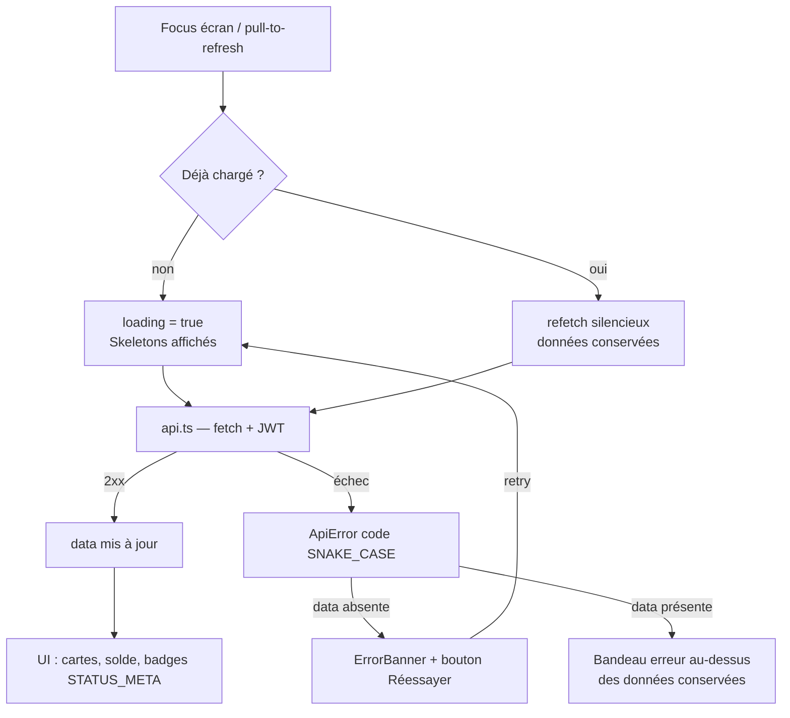

# API_INTEGRATION_SYNC — Synchronisation données API ↔ écrans mobiles

> Périmètre : `apps/mobile/src/hooks/useApiResource.ts`, `apps/mobile/src/services/api.ts`
> et leur consommation par `app/(tabs)/listings.tsx` et `app/(tabs)/wallet.tsx`.
> Principe cardinal : **le serveur est la seule source de vérité** — le mobile ne déduit
> jamais un état, il l'affiche.

---

## 1. Les trois couches

```
Écran (listings.tsx / wallet.tsx)   ← affichage, mapping présentation
        │ useApiResource(fetcher)
Hook (useApiResource.ts)            ← cycle de vie : focus, loading, erreurs, refresh
        │ api.getListings() / api.getWallet() / api.getTransactions()
Transport (api.ts)                  ← fetch + JWT, types miroirs, ApiError SNAKE_CASE
        │ HTTP
API Fastify                         ← source de vérité (statuts, centimes)
```

### Transport — `api.ts`

- `request<T>()` ajoute le JWT (Zustand `useAuthStore`, persisté MMKV) et normalise
  **toute** erreur en `ApiError { code: 'SNAKE_CASE', status }`. Pas de token → throw
  `NO_AUTH_TOKEN` avant tout appel réseau.
- Les types (`ApiListing`, `ApiWallet`, `ApiTransaction`, `ApiListingPhoto`) sont le
  **miroir exact des réponses serveur** — alignés sur les `select` Prisma des routes.
  Toute évolution de route impose de mettre à jour ces types ici, nulle part ailleurs.
- Argent : **centimes Int de bout en bout**. La conversion € n'existe qu'à l'affichage
  (`formatEur` / `AmountText`).

### Cycle de vie — `useApiResource<T>(fetcher)`

Contrat de retour : `{ data, loading, refreshing, error, retry, refresh }`.

| Situation | Comportement |
|---|---|
| Premier focus de l'écran | `loading=true` → l'écran affiche des **Skeletons** |
| Retour sur l'onglet (déjà chargé) | **refetch silencieux** : les données restent affichées, mise à jour en arrière-plan — une annonce validée apparaît sans relancer l'app |
| Pull-to-refresh | `refresh()` → `refreshing=true` (RefreshControl), données conservées |
| Échec initial | `error` (code SNAKE_CASE) + `data=null` → **ErrorBanner plein écran + retry** |
| Échec d'un refetch | `error` renseigné mais `data` conservé → bandeau au-dessus des données périmées |
| Appels concurrents | verrou `inFlight` : un seul fetch à la fois (focus rapide, double pull) |

Décision « chargement vs silencieux » : `hasLoaded` (ref) — jamais l'état React, pour
éviter les courses au re-render.

### Écrans — règles de mapping

**listings.tsx** — `toRow(ApiListing) → ListingRow` :
- `prixCents = prixPublie ?? prixHaut` (prix choisi par l'utilisateur, sinon estimation
  haute IA ; `null` avant brouillon → prix masqué, jamais de 0 inventé) ;
- `status` affiché **tel quel** (STATUS_META) — jamais recalculé côté client ;
- vignette = première photo (`API_BASE + photos[0].url`), lettre kraft sinon ;
- `quand = formatRelativeFr(updatedAt)`.

**wallet.tsx** — deux ressources indépendantes (`getWallet`, `getTransactions`) :
refresh groupé, erreur = première des deux ; le switch auto-recharge est en
**lecture seule** (aucun endpoint de mutation n'existe — le hook `authorize()` serveur
reste le seul déclencheur).

---

## 2. Flux de données



---

## 3. Invariants à respecter pour tout nouvel écran branché

1. Passer par `useApiResource` — pas de `useEffect + fetch` ad hoc.
2. Typer la réponse dans `api.ts` (miroir du `select` serveur), jamais dans l'écran.
3. Couvrir les 4 états : skeleton (loading), ErrorBanner + retry (error), EmptyState
   (liste vide), données. Un écran sans EmptyState est refusé (gate P6).
4. Statuts et montants viennent du serveur ; le client n'anticipe jamais une transition
   (pas d'optimistic update sur la machine à états).
5. Codes erreur traduits en français simple au niveau écran (`NETWORK_ERROR` →
   « Impossible de joindre le serveur… ») — le code technique reste entre parenthèses
   seulement s'il n'a pas de traduction.
